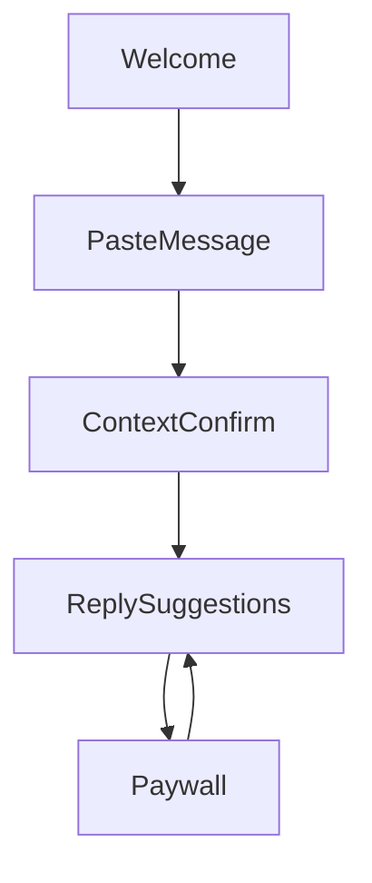

# Reply Assistant — UI Handoff (Android-first)

## Design principles
- Utility-first, calm UI: **white background**, soft accent, minimal visual noise.
- One-hand usage: **primary actions at the bottom** (sticky footer).
- Friendly Indian tone: casual English/Hinglish, no “AI robot” language.

## Theme tokens
Source: `src/theme/*`

### Colors (`src/theme/colors.js`)
- `background`: #FFFFFF
- `surface`: #F7FAFC (cards/sections)
- `text`: #0F172A
- `textMuted`: #475569
- `border`: #E2E8F0
- `accent`: #2F80ED (primary buttons)
- `accentSoft`: #EAF2FF (selected pills)

### Spacing (`src/theme/spacing.js`)
Scale: 4 / 8 / 12 / 16 / 20 / 24 / 32

### Radii (`src/theme/radii.js`)
- Cards: `lg` (18)
- Buttons: `xl` (24)
- Pills: `pill` (999)

### Typography (`src/theme/typography.js`)
Android uses **Roboto** (system default) to keep startup fast and avoid font loading complexity.
- Headings: semibold/medium
- Body: regular

## Reusable components
Source: `src/components/*`

- `Screen`: page wrapper with SafeArea + optional sticky bottom action bar (use for one-hand UX).
- `Header`: centered title with optional back button.
- `AppButton`: `primary`, `secondary`, `ghost` variants; 52px height (46px for compact cases).
- `AppCard`: rounded, subtle border/shadow for content grouping.
- `AppTextInput`: consistent padding, radius, placeholder color.
- `Pill`: selectable chips for relationship/mood.
- `ReplyCard`: tone label + reply text + Copy button.

## Navigation flow
Source: `src/navigation/AppNavigator.js`

## Screen specs

### 1) Welcome / Trust (`src/screens/WelcomeScreen.js`)
- Purpose: explain value + reduce privacy fear
- Primary CTA: **Try it now**
- Footnote: “No sign-up required”

### 2) Paste Message (`src/screens/PasteMessageScreen.js`)
- Purpose: paste the stuck message
- Multiline input (large, calm)
- Helper: “Last message is usually enough.”
- Primary CTA: **Get reply**
- Behavior: runs `inferContextFromText()` and navigates to Context Confirmation

### 3) Context Confirmation (`src/screens/ContextConfirmScreen.js`)
- Shows: Relationship, Mood, Situation
- Buttons: **Yes, looks right** (primary), **Change** (secondary)
- “Change” reveals pills for Relationship + Mood
- Behavior: “Yes” generates replies via `generateReplies()` and navigates to suggestions

### 4) Reply Suggestions (`src/screens/ReplySuggestionsScreen.js`)
- 3 reply cards (tone + text)
- Copy button uses `expo-clipboard`
- Bottom actions: “Make it softer”, “Make it shorter”
- Paywall trigger: after a few refinement taps (non-blocking)

### 5) Paywall (`src/screens/PaywallScreen.js`)
- Calm upgrade message and benefits
- Price: ₹149 / month
- Primary: Upgrade (placeholder), Secondary: Maybe later

## Mock logic (for now)
Source: `src/mock/*`
- `inferContextFromText()` produces a best-guess context (simple heuristics).
- `generateReplies()` returns short, human replies (and a work-friendly set for Work relationship).
- `makeRepliesSofter()` and `makeRepliesShorter()` transform suggestions locally.

